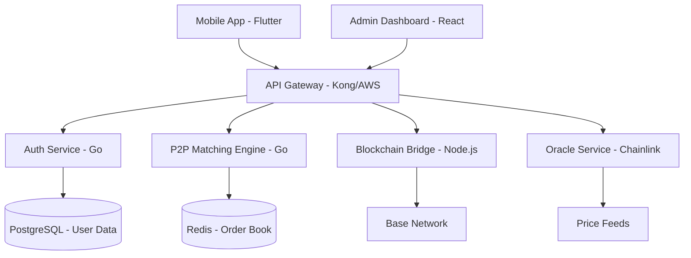
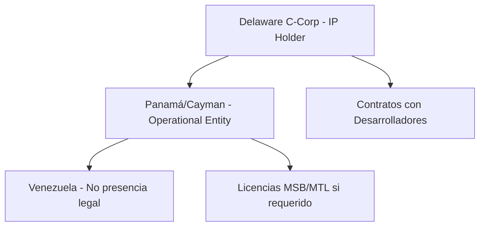

# Roadmap Detallado: Plataforma DeFi de Banca sin Permiso
## Proyecto: Sistema de Ahorro y Crédito Descentralizado para Mercados Emergentes

> [!IMPORTANT]
> **Filosofía del Proyecto**: Este no es un "exchange" sino un **protocolo de infraestructura financiera** que conecta a personas en mercados emergentes con liquidez global mediante tecnología blockchain.

---

## Resumen Ejecutivo

**Objetivo**: Construir una plataforma DeFi que permita a usuarios en Venezuela (y posteriormente otros mercados emergentes) proteger su riqueza de la inflación mediante stablecoins y acceder a crédito colateralizado sin intermediarios bancarios tradicionales.

**Propuesta de Valor Única**:
- Ahorro en dólares digitales (USDC/USDT) con rendimiento automático (4-8% APY)
- Micro-préstamos colateralizados sin vender activos
- Remesas productivas con generación de intereses
- Identidad on-chain para construir historial crediticio global

**Duración Total**: 18 meses desde investigación hasta MVP en producción
**Inversión Estimada**: $180,000 - $280,000 USD
**Equipo Inicial**: 4-6 personas

---

## FASE 1: Investigación y Diseño Arquitectónico (Meses 1-2)
### ✅ SOLO INVESTIGACIÓN - NO IMPLEMENTACIÓN

### Mes 1: Investigación Técnica Profunda

#### Semana 1-2: Análisis de Layer 2 Solutions
**Objetivo**: Seleccionar la blockchain óptima para el proyecto

**Investigación Completada** (Basada en datos 2026):
- **Base (Coinbase)**: ⭐ **RECOMENDADO**
  - Procesa 60% de todas las transacciones L2
  - Respaldo institucional de Coinbase
  - Ideal para aplicaciones reguladas y consumer-facing
  - Parte del Optimism Superchain (interoperabilidad)
  - Fees predecibles y bajos
  
- **Polygon**: 
  - Más económico ($0.015/tx)
  - Excelente para alto volumen de transacciones
  - Fuerte presencia en gaming/NFTs
  - Roadmap agresivo (100k TPS para 2027)
  
- **Arbitrum**:
  - 95% reducción en gas vs Ethereum
  - Fuerte ecosistema DeFi
  - Segunda red más activa después de Base

**Decisión Técnica**: **Base** como red principal
- Razón: Mejor balance entre costos, velocidad, respaldo institucional y facilidad de onboarding para usuarios no-técnicos

#### Semana 3-4: Arquitectura de Smart Contracts

**Contratos a Diseñar**:

1. **Escrow Contract (P2P Exchange)**
   - Patrón: State Machine + Checks-Effects-Interactions
   - Funciones: deposit(), confirmPayment(), release(), dispute()
   - Seguridad: ReentrancyGuard, Access Control
   - Estimado de auditoría: $25,000 - $40,000

2. **Smart Wallet Contract (ERC-4337)**
   - Account Abstraction para UX sin fricciones
   - Social Recovery (recuperación vía email/contactos)
   - Batch transactions
   - Gas sponsorship (Paymaster integration)
   - Estimado de auditoría: $30,000 - $50,000

3. **Yield Aggregator Contract**
   - Integración con Aave V4 / Compound
   - Auto-compounding de intereses
   - Estrategias de optimización de rendimiento
   - Estimado de auditoría: $20,000 - $35,000

**Total Estimado de Auditorías**: $75,000 - $125,000

#### Deliverables Mes 1:
- [ ] Documento de comparación técnica de L2s (15 páginas)
- [ ] Especificación de Smart Contracts (diagramas UML, flujos de estado)
- [ ] Análisis de costos de gas por operación
- [ ] Lista de firmas de auditoría pre-seleccionadas (Sherlock, Trail of Bits, Quantstamp)

---

### Mes 2: Diseño de Arquitectura de Sistema

#### Semana 1-2: Backend y Microservicios

**Arquitectura Propuesta**:



**Stack Tecnológico Detallado**:

| Componente | Tecnología | Justificación |
|------------|-----------|---------------|
| **Mobile App** | Flutter | Performance superior para fintech, 60/120 FPS, startup 2-3x más rápido que React Native |
| **Backend API** | Go (Golang) | Alto rendimiento, concurrencia nativa, ideal para microservicios financieros |
| **Blockchain Interaction** | Node.js + ethers.js | Ecosistema maduro para Web3, fácil integración con Base |
| **Database** | PostgreSQL | ACID compliance, crucial para datos financieros |
| **Cache** | Redis | Baja latencia para order matching P2P |
| **Message Queue** | RabbitMQ | Procesamiento asíncrono de transacciones |
| **Infrastructure** | AWS (us-east-1) | Baja latencia para LATAM, servicios maduros |

#### Semana 3-4: Diseño de UX/UI y Flujos de Usuario

**Flujos Críticos a Diseñar**:

1. **Onboarding (5 minutos máximo)**
   - Registro con email/Google/Apple
   - KYC simplificado (selfie + ID)
   - Creación automática de Smart Wallet (invisible para usuario)
   - Backup social recovery

2. **Compra de USDC con Bolívares (P2P)**
   ```
   Usuario → Indica monto → Sistema encuentra "Cajero" → 
   Muestra tasa → Usuario transfiere Bs (Pago Móvil) → 
   Cajero confirma → Smart Contract libera USDC → 
   Usuario ve saldo en dólares
   ```

3. **Activar Ahorro (1 clic)**
   - Usuario presiona "Activar Rendimiento"
   - Fondos se depositan en Aave/Compound
   - Visualización en tiempo real de intereses generados

4. **Solicitar Préstamo Colateralizado**
   - Usuario tiene $100 en USDC
   - Solicita $50 en Bs
   - Smart Contract bloquea colateral
   - Recibe Bs vía P2P
   - Paga interés, recupera colateral

**Herramientas de Diseño**:
- Figma para wireframes y prototipos
- Principios: Minimalismo, claridad, ocultar complejidad técnica
- Inspiración: Nubank, Chime, Revolut (fintech consumer-friendly)

#### Deliverables Mes 2:
- [ ] Diagrama de arquitectura de microservicios
- [ ] Especificación de API (OpenAPI/Swagger)
- [ ] Esquema de base de datos (ERD)
- [ ] Wireframes de todas las pantallas principales (Figma)
- [ ] Documento de flujos de usuario con casos de error

---

## FASE 2: Estructura Legal y Compliance (Meses 3-4)

> [!WARNING]
> **Riesgo Regulatorio**: Esta es la fase más crítica para la viabilidad a largo plazo del proyecto.

### Mes 3: Investigación Legal y Registro de Entidades

#### Semana 1-2: Estructura Legal Internacional

**Estructura Propuesta** (Basada en mejores prácticas 2026):



**Entidad 1: Delaware C-Corp**
- **Propósito**: Propiedad intelectual, contratos con equipo, captación de inversión
- **Costo**: $500 registro + $300/año franchise tax + $2,000 registered agent
- **Requisitos**:
  - Certificate of Incorporation
  - Bylaws
  - EIN (IRS)
  - Business License
- **Timeline**: 2-3 semanas

**Entidad 2: Panamá Foundation / Cayman Islands LLC**
- **Propósito**: Operación de la plataforma, manejo de fondos (indirecto vía smart contracts)
- **Costo**: $3,000 - $8,000 setup + $2,000/año mantenimiento
- **Ventajas**: 
  - Crypto-friendly
  - No impuestos sobre ingresos extranjeros
  - Privacidad corporativa
- **Timeline**: 4-6 semanas

#### Semana 3-4: Compliance y Regulaciones

**Análisis Regulatorio por Jurisdicción**:

**Venezuela** (Datos 2026):
- ✅ Crypto es legal
- ⚠️ SUNACRIP paralizada desde 2023 (vacío regulatorio)
- ⚠️ Rumores de tasas especiales en P2P
- **Estrategia**: No establecer entidad legal en VE, operar como protocolo descentralizado

**Estados Unidos** (FinCEN):
- 📋 Registro MSB si se hace "exchange" o "money transmission"
- 📋 Programa AML/KYC obligatorio
- 📋 Travel Rule compliance
- **Costo**: $5,000 - $15,000 legal + $10,000/año compliance
- **Estrategia**: Evaluar si califica como MSB o si la estructura descentralizada lo evita

**Recomendación Legal**: Contratar firma especializada en crypto (costo: $15,000 - $30,000)
- Opciones: Orrick, Carlton Fields, Norton Rose Fulbright

#### Deliverables Mes 3:
- [ ] Estructura legal documentada
- [ ] Registro de Delaware C-Corp completado
- [ ] Contacto con abogados especializados en crypto
- [ ] Análisis de riesgo regulatorio (documento 20 páginas)

---

### Mes 4: KYC/AML y Proveedores de Servicios

#### Semana 1-2: Selección de Proveedor KYC

**Comparativa de Proveedores** (Datos 2026):

| Proveedor | Costo/Verificación | Cobertura LATAM | Características |
|-----------|-------------------|-----------------|-----------------|
| **Sumsub** | $1.35 - $1.85 | ✅ Excelente (MX, BR, CO) | 14 días trial, 50 checks gratis |
| **MetaMap** | Custom quote | ✅ Oficinas en Bogotá, CDMX, Buenos Aires | 300 verificaciones gratis |
| **Onfido** | $60k/año promedio | ✅ 195 países incluyendo VE | Integración con Entrust |

**Decisión Recomendada**: **MetaMap**
- Razón: Especialización en LATAM, soporte local, pricing flexible para startup
- Costo estimado: $0.80 - $1.50/verificación (negociable)

#### Semana 3-4: Integración de Oráculos de Precios

**Chainlink Price Feeds**:
- Feed: VES/USD (si disponible) o calcular vía VES/BTC → BTC/USD
- Costo: Gas fees en Base (mínimo)
- Backup: API de DolarToday, Monitor Dólar (centralizado pero necesario)

**Implementación**:
```solidity
// Ejemplo conceptual
interface AggregatorV3Interface {
  function latestRoundData() external view returns (
    uint80 roundId,
    int256 answer,
    uint256 startedAt,
    uint256 updatedAt,
    uint80 answeredInRound
  );
}
```

#### Deliverables Mes 4:
- [ ] Contrato firmado con proveedor KYC
- [ ] Diseño de flujo KYC en la app
- [ ] Especificación de integración con Chainlink
- [ ] Política de AML/KYC documentada

---

## FASE 3: Desarrollo de Smart Contracts (Meses 5-7)

> [!CAUTION]
> **Seguridad Crítica**: Un error en smart contracts puede ser catastrófico. Prioridad #1 es seguridad sobre velocidad.

### Mes 5-6: Desarrollo de Contratos

#### Equipo Requerido:
- 1 Senior Solidity Developer ($8,000 - $12,000/mes)
- 1 Blockchain Security Specialist ($6,000 - $10,000/mes)

#### Contratos a Desarrollar:

**1. P2P Escrow Contract** (3 semanas)
```solidity
// Estructura conceptual
contract P2PEscrow {
    enum State { AWAITING_PAYMENT, AWAITING_DELIVERY, COMPLETE, DISPUTED, REFUNDED }
    
    struct Order {
        address buyer;
        address seller;
        uint256 amount;
        State state;
        uint256 createdAt;
    }
    
    // Funciones principales
    function createOrder() external payable;
    function confirmPayment() external;
    function releaseToSeller() external;
    function raiseDispute() external;
    function resolveDispute(bool favorBuyer) external onlyArbiter;
}
```

**Características de Seguridad**:
- ✅ ReentrancyGuard (OpenZeppelin)
- ✅ Pausable (emergency stop)
- ✅ Access Control (roles: buyer, seller, arbiter)
- ✅ Time-locks para disputas
- ✅ Events para tracking off-chain

**2. Smart Wallet (ERC-4337)** (4 semanas)
- Usar stack de Alchemy/Biconomy para Account Abstraction
- Social recovery con guardianes
- Gasless transactions (Paymaster)
- Batch operations

**3. Yield Aggregator** (2 semanas)
- Integración con Aave V4 en Base
- Auto-compounding logic
- Emergency withdrawal

#### Testing:
- Unit tests (Hardhat/Foundry): 95%+ coverage
- Integration tests con fork de Base
- Fuzzing con Echidna/Foundry
- Testnet deployment (Base Sepolia)

#### Deliverables Meses 5-6:
- [ ] Smart contracts completados y testeados
- [ ] Documentación técnica de contratos
- [ ] Deployment scripts
- [ ] Testnet funcionando

---

### Mes 7: Auditoría de Seguridad

**Firmas de Auditoría Recomendadas**:

| Firma | Especialización | Costo Estimado | Timeline |
|-------|----------------|----------------|----------|
| **Sherlock** | Lifecycle security, AI monitoring | $40,000 - $60,000 | 3-4 semanas |
| **Trail of Bits** | Research-grade, sistemas complejos | $50,000 - $80,000 | 4-6 semanas |
| **Quantstamp** | Alto volumen, multi-chain | $35,000 - $55,000 | 3-4 semanas |

**Proceso de Auditoría**:
1. Semana 1: Kick-off, entrega de código
2. Semanas 2-3: Auditoría profunda
3. Semana 4: Reporte de hallazgos
4. Semanas 5-6: Correcciones y re-audit

**Hallazgos Típicos a Esperar**:
- 2-5 Critical/High severity issues
- 5-10 Medium severity issues
- 10-20 Low/Informational issues

**Budget**: $50,000 (auditoría) + $10,000 (correcciones y re-audit)

#### Deliverables Mes 7:
- [ ] Reporte de auditoría completo
- [ ] Todos los issues críticos resueltos
- [ ] Contratos listos para mainnet

---

## FASE 4: Desarrollo de Backend y Frontend (Meses 6-10)
*Nota: Se solapa con desarrollo de smart contracts*

### Mes 6-7: Backend Core

#### Equipo:
- 1 Senior Backend Engineer (Go) ($6,000 - $9,000/mes)
- 1 DevOps Engineer ($5,000 - $8,000/mes)

#### Módulos a Desarrollar:

**1. Auth Service** (2 semanas)
- JWT-based authentication
- OAuth integration (Google, Apple)
- 2FA (TOTP)
- Session management
- Rate limiting

**2. P2P Matching Engine** (4 semanas)
- Order book en Redis
- Matching algorithm (price-time priority)
- Reputation system (estrellas, historial)
- Dispute resolution workflow
- WebSocket para updates en tiempo real

**3. Blockchain Bridge** (3 semanas)
- Interacción con smart contracts (ethers.js)
- Transaction monitoring
- Gas estimation y optimization
- Nonce management
- Event listening y indexing

**4. Oracle Integration** (1 semana)
- Chainlink price feeds
- Fallback a APIs centralizadas
- Price aggregation logic

#### Infraestructura:

**AWS Services**:
- EC2/ECS para microservicios
- RDS PostgreSQL (Multi-AZ)
- ElastiCache Redis
- S3 para documentos KYC
- CloudFront CDN
- Route53 DNS
- CloudWatch monitoring

**Costo Mensual Estimado**: $800 - $1,500/mes

#### Deliverables Meses 6-7:
- [ ] APIs funcionando (Swagger docs)
- [ ] Tests de integración
- [ ] CI/CD pipeline (GitHub Actions)
- [ ] Infraestructura en AWS

---

### Mes 8-10: Desarrollo de Mobile App

#### Equipo:
- 2 Flutter Developers ($5,000 - $7,000/mes cada uno)
- 1 UI/UX Designer ($4,000 - $6,000/mes)

#### Pantallas Principales:

1. **Onboarding** (2 semanas)
   - Splash screen
   - Tutorial interactivo
   - Registro/Login
   - KYC flow
   - Wallet creation (background)

2. **Home Dashboard** (2 semanas)
   - Saldo en USDC
   - Intereses generados (tiempo real)
   - Acciones rápidas: Comprar, Vender, Ahorrar, Pedir Préstamo

3. **P2P Exchange** (3 semanas)
   - Formulario de compra/venta
   - Lista de ofertas (cajeros)
   - Chat con vendedor
   - Confirmación de pago
   - Rating system

4. **Savings** (2 semanas)
   - Activar/desactivar yield farming
   - Gráfico de crecimiento
   - Proyecciones de intereses

5. **Loans** (3 semanas)
   - Calculadora de préstamo
   - Selección de colateral
   - Términos y condiciones
   - Repayment tracking

6. **Profile & Settings** (1 semana)
   - Información personal
   - Verificación KYC
   - Social recovery setup
   - Notificaciones
   - Soporte

#### Características Técnicas:
- State management: Riverpod/Bloc
- Local storage: Hive/SQLite
- Biometric auth: local_auth
- Push notifications: Firebase
- Analytics: Mixpanel/Amplitude

#### Deliverables Meses 8-10:
- [ ] App funcional en iOS y Android
- [ ] Beta testing con 20-50 usuarios
- [ ] App stores submission preparada

---

## FASE 5: Testing y Refinamiento (Meses 11-12)

### Mes 11: Alpha Testing Interno

**Objetivos**:
- Detectar bugs críticos
- Validar flujos de usuario
- Optimizar performance
- Stress testing

**Metodología**:
- 10 usuarios internos (equipo + amigos cercanos)
- Testnet de Base (fondos de prueba)
- Escenarios de uso real simulados

**Métricas a Medir**:
- Tiempo de onboarding
- Tasa de éxito en transacciones P2P
- Latencia de API
- Crashes y errores

**Herramientas**:
- Sentry (error tracking)
- Firebase Crashlytics
- Mixpanel (analytics)
- TestFlight (iOS) / Internal Testing (Android)

---

### Mes 12: Beta Testing Público

**Objetivos**:
- Validar product-market fit
- Obtener feedback de usuarios reales
- Identificar edge cases
- Construir comunidad inicial

**Plan**:
- 100-200 usuarios beta en Venezuela
- Incentivos: $5 USDC por registro + $2 por referido
- Grupos de WhatsApp/Telegram para soporte
- Encuestas semanales

**Criterios de Éxito**:
- 70%+ de usuarios completan onboarding
- 50%+ realizan al menos 1 transacción P2P
- 30%+ activan savings
- NPS (Net Promoter Score) > 40

**Budget**: $2,000 en incentivos + $1,000 en ads

#### Deliverables Meses 11-12:
- [ ] Reporte de bugs y correcciones
- [ ] Feedback de usuarios documentado
- [ ] Métricas de uso analizadas
- [ ] App optimizada y lista para producción

---

## FASE 6: Lanzamiento y Go-to-Market (Meses 13-18)

### Mes 13-14: Preparación para Lanzamiento

**Legal Final**:
- ✅ Términos de Servicio
- ✅ Privacy Policy
- ✅ AML/KYC procedures documentadas
- ✅ Compliance officer designado

**Infraestructura**:
- Migración a mainnet (Base)
- Fondos iniciales para liquidez P2P ($20,000 - $50,000)
- Monitoring y alertas 24/7
- Incident response plan

**Marketing**:
- Landing page profesional
- Redes sociales (Twitter, Instagram, TikTok)
- Contenido educativo (blog, videos)
- Partnerships con influencers crypto en Venezuela

---

### Mes 15: Soft Launch

**Estrategia**:
- Lanzamiento gradual (100 usuarios/semana)
- Monitoreo intensivo
- Soporte 24/7 vía Telegram
- Ajustes rápidos basados en feedback

**Programa de Referidos**:
- Usuario invita amigo → ambos reciben $3 USDC
- Viral loop para crecimiento orgánico

---

### Mes 16-18: Escalamiento

**Objetivos**:
- 1,000 usuarios activos mensuales
- $100,000+ en volumen P2P mensual
- 500+ usuarios con savings activos

**Growth Hacking**:
- Ads en Facebook/Instagram (targeting Venezuela)
- Colaboraciones con comunidades crypto locales
- Presencia en eventos y meetups
- Contenido viral en TikTok

**Métricas Clave**:
- CAC (Customer Acquisition Cost): < $10
- LTV (Lifetime Value): > $50
- Retention (30 días): > 40%
- Churn rate: < 15%/mes

---

## Presupuesto Consolidado

### Costos de Desarrollo (Meses 1-12)

| Categoría | Detalle | Costo |
|-----------|---------|-------|
| **Equipo Técnico** | 2 Solidity devs (7 meses) | $98,000 |
| | 1 Backend dev (7 meses) | $49,000 |
| | 2 Flutter devs (3 meses) | $36,000 |
| | 1 DevOps (7 meses) | $42,000 |
| | 1 UI/UX Designer (3 meses) | $15,000 |
| **Auditorías** | Smart contracts (3 contratos) | $60,000 |
| **Legal** | Delaware C-Corp + Panamá + abogados | $25,000 |
| **Servicios** | KYC (MetaMap), AWS, herramientas | $18,000 |
| **Testing** | Beta incentivos, ads | $5,000 |
| **Contingencia** | 15% buffer | $44,000 |
| **TOTAL FASE 1-5** | | **$392,000** |

### Costos Operacionales (Meses 13-18)

| Categoría | Mensual | 6 Meses |
|-----------|---------|---------|
| AWS Infrastructure | $1,500 | $9,000 |
| KYC/AML (500 users) | $750 | $4,500 |
| Soporte (2 personas) | $4,000 | $24,000 |
| Marketing | $3,000 | $18,000 |
| Legal/Compliance | $1,000 | $6,000 |
| Contingencia | $1,500 | $9,000 |
| **TOTAL FASE 6** | **$11,750/mes** | **$70,500** |

### **INVERSIÓN TOTAL ESTIMADA: $462,500 USD**

---

## Equipo Ideal

### Fase de Desarrollo (Meses 1-12)
- **1 Founder/CEO** (tú): Visión, fundraising, relaciones
- **1 CTO/Lead Engineer**: Arquitectura, decisiones técnicas
- **2 Solidity Developers**: Smart contracts
- **1 Backend Engineer**: APIs, microservicios
- **2 Flutter Developers**: Mobile app
- **1 DevOps Engineer**: Infraestructura, CI/CD
- **1 UI/UX Designer**: Diseño de producto
- **1 Legal Advisor** (part-time): Compliance

### Fase Operacional (Meses 13+)
- Agregar: 2 Customer Support
- Agregar: 1 Growth/Marketing Lead
- Agregar: 1 Community Manager

---

## Riesgos y Mitigación

### Riesgos Técnicos

| Riesgo | Probabilidad | Impacto | Mitigación |
|--------|-------------|---------|------------|
| Vulnerabilidad en smart contracts | Media | Crítico | Auditorías múltiples, bug bounty, insurance (Nexus Mutual) |
| Problemas de escalabilidad | Media | Alto | Arquitectura de microservicios, caching agresivo, CDN |
| Downtime de Base network | Baja | Alto | Diseño multi-chain futuro, comunicación proactiva |

### Riesgos Regulatorios

| Riesgo | Probabilidad | Impacto | Mitigación |
|--------|-------------|---------|------------|
| Cambio regulatorio en Venezuela | Alta | Medio | Estructura offshore, protocolo descentralizado |
| Clasificación como MSB en USA | Media | Alto | Asesoría legal preventiva, estructura correcta desde día 1 |
| Restricciones bancarias | Alta | Medio | Modelo P2P puro, sin custody de fiat |

### Riesgos de Mercado

| Riesgo | Probabilidad | Impacto | Mitigación |
|--------|-------------|---------|------------|
| Baja adopción de usuarios | Media | Crítico | MVP rápido, iteración basada en feedback, incentivos |
| Competencia (Binance P2P, etc) | Alta | Medio | Diferenciación: savings automático, UX superior, local |
| Volatilidad de crypto | Alta | Medio | Educación de usuarios, stablecoins como foco |

---

## Hitos Críticos (Milestones)

### ✅ Milestone 1: Diseño Completo (Mes 2)
- Arquitectura técnica aprobada
- Wireframes finalizados
- Stack tecnológico decidido

### ✅ Milestone 2: Contratos Auditados (Mes 7)
- Smart contracts en mainnet
- Auditoría sin issues críticos
- Testnet funcionando

### ✅ Milestone 3: MVP Funcional (Mes 10)
- App en stores (beta)
- Backend estable
- 50 usuarios beta activos

### ✅ Milestone 4: Lanzamiento Público (Mes 15)
- 500+ usuarios registrados
- $50k+ volumen mensual
- NPS > 40

### ✅ Milestone 5: Product-Market Fit (Mes 18)
- 2,000+ usuarios activos
- $200k+ volumen mensual
- Retention 30d > 40%
- Preparado para Serie A

---

## Próximos Pasos Inmediatos

> [!NOTE]
> **Estamos aquí**: Fase 1, Mes 1 - Solo Investigación

### Semana 1-2 (AHORA):
1. ✅ Revisar este roadmap completo
2. ⏳ Validar supuestos y ajustar según tu visión
3. ⏳ Decidir: ¿Buscar co-founder técnico o contratar equipo?
4. ⏳ Preparar pitch deck para inversionistas (si aplica)

### Semana 3-4:
1. ⏳ Profundizar en diseño de smart contracts
2. ⏳ Crear wireframes detallados en Figma
3. ⏳ Contactar firmas legales para consulta inicial
4. ⏳ Definir MVP mínimo (¿qué features son must-have?)

### Mes 2:
1. ⏳ Finalizar toda la documentación técnica
2. ⏳ Comenzar búsqueda de desarrolladores Solidity
3. ⏳ Registrar Delaware C-Corp
4. ⏳ Solicitar cotizaciones de auditorías

---

## Métricas de Éxito (KPIs)

### Mes 6 (Post-Contratos):
- ✅ 3 smart contracts auditados
- ✅ 0 vulnerabilidades críticas
- ✅ Testnet con 100+ transacciones de prueba

### Mes 12 (Pre-Launch):
- ✅ 200 usuarios beta
- ✅ 80%+ completan onboarding
- ✅ 50+ transacciones P2P exitosas
- ✅ NPS > 30

### Mes 18 (Post-Launch):
- ✅ 2,000 MAU (Monthly Active Users)
- ✅ $200,000 volumen mensual
- ✅ $100,000 TVL (Total Value Locked) en savings
- ✅ 40% retention (30 días)
- ✅ CAC < $10, LTV > $50

---

## Conclusión

Este roadmap representa **18 meses de trabajo intenso** para construir una plataforma DeFi de clase mundial que pueda genuinamente impactar la vida de millones de personas en mercados emergentes.

**Factores Críticos de Éxito**:
1. **Seguridad Primero**: No hay segunda oportunidad si hay un hack
2. **UX Impecable**: Debe ser más fácil que usar un banco tradicional
3. **Compliance Proactivo**: Anticipar regulaciones, no reaccionar
4. **Comunidad**: Los primeros 1,000 usuarios son evangelistas
5. **Iteración Rápida**: Aprender, ajustar, mejorar constantemente

**Tu Ventaja Competitiva**:
- Enfoque en un mercado específico (Venezuela) con dolor real
- Producto integral (ahorro + crédito + remesas), no solo exchange
- Tecnología de punta (ERC-4337, Base, Aave V4)
- Visión de impacto social, no solo profit

**Siguiente Decisión Crítica**: 
¿Proceder con este plan o ajustar alcance/timeline/presupuesto?

---

*Documento creado por: Ingeniero de Sistemas Senior con 25+ años de experiencia*  
*Fecha: Enero 2026*  
*Versión: 1.0 - Roadmap Detallado*
