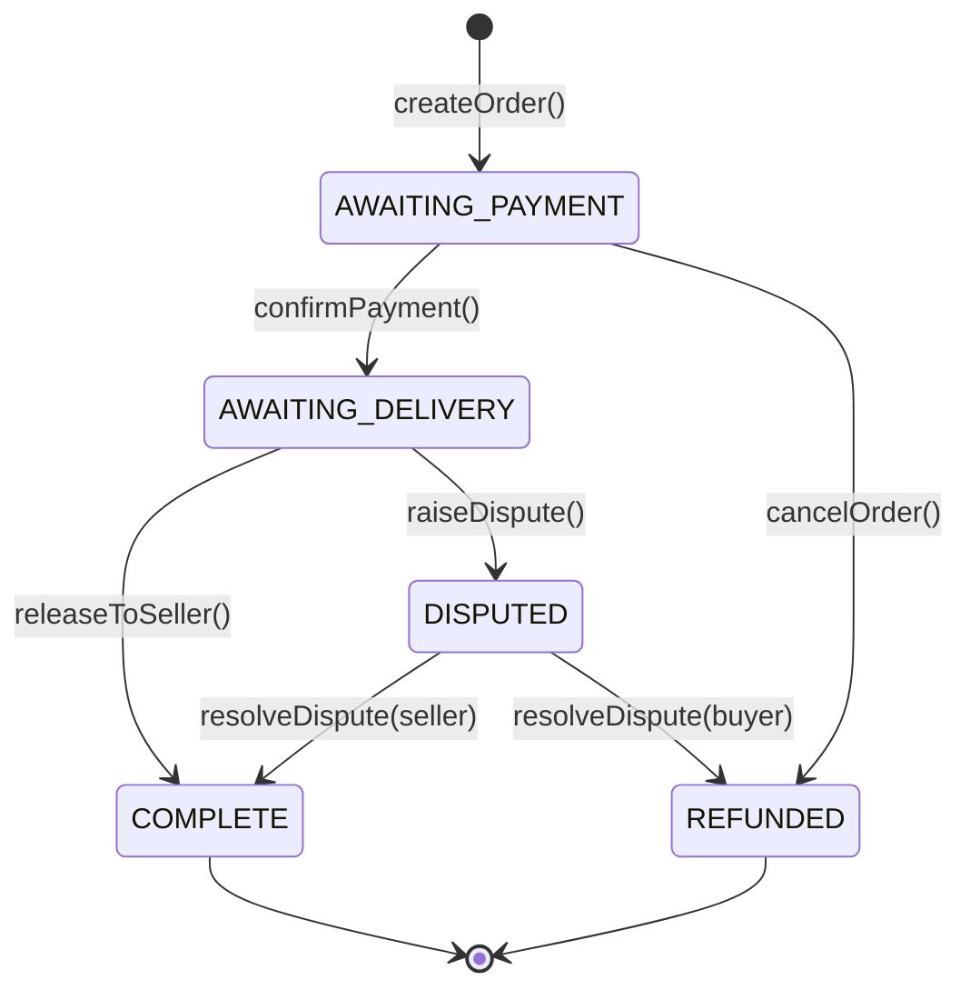
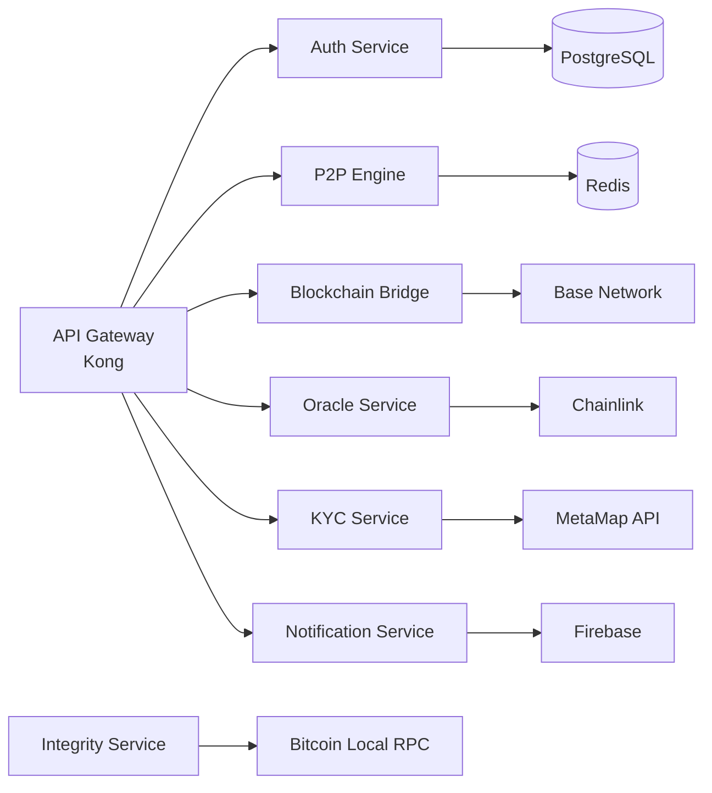
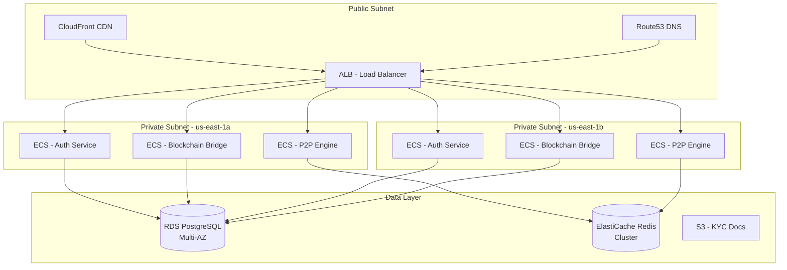

# Arquitectura Técnica Detallada
## Plataforma DeFi de Banca sin Permiso

> [!NOTE]
> Este documento describe la arquitectura técnica completa del sistema. Es un documento vivo que se actualizará durante el desarrollo.

---

## Tabla de Contenidos

1. [Visión General del Sistema](#visión-general-del-sistema)
2. [Arquitectura de Smart Contracts](#arquitectura-de-smart-contracts)
3. [Backend: Microservicios](#backend-microservicios)
4. [Frontend: Mobile App](#frontend-mobile-app)
5. [Infraestructura y DevOps](#infraestructura-y-devops)
6. [Seguridad](#seguridad)
7. [Escalabilidad](#escalabilidad)

---

## Visión General del Sistema

### Arquitectura de Alto Nivel

```mermaid
graph TB
    subgraph "Client Layer"
        A[Flutter Mobile App<br/>iOS + Android]
    end
    
    subgraph "API Gateway Layer"
        B[Kong API Gateway<br/>Rate Limiting + Auth]
    end
    
    subgraph "Application Layer - Microservices"
        C[Auth Service<br/>Go]
        D[P2P Matching Engine<br/>Go + Redis]
        E[Blockchain Bridge<br/>Node.js]
        F[Oracle Service<br/>Chainlink Integration]
        G[KYC Service<br/>MetaMap Integration]
        G[KYC Service<br/>MetaMap Integration]
        H[Notification Service<br/>Firebase]
        N[Integrity Service<br/>BTC Anchoring]
    end
    
    subgraph "Data Layer"
        I[(PostgreSQL<br/>User Data + Transactions)]
        J[(Redis<br/>Order Book + Cache)]
        K[(S3<br/>KYC Documents)]
    end
    
        L[Base Network<br/>Layer 2]
        M[Smart Contracts<br/>Escrow + Wallet + Yield]
    end

    subgraph "Local Node"
        O[Bitcoin Pruned Node<br/>Data Verification]
    end
    
    A --> B
    B --> C
    B --> D
    B --> E
    B --> F
    B --> G
    B --> H
    B --> N

    C --> I
    D --> J
    E --> M
    F --> L
    G --> K
    N --> O
    
    M --> L
```

### Stack Tecnológico Completo

| Capa | Tecnología | Versión | Justificación |
|------|-----------|---------|---------------|
| **Blockchain** | Base (Optimism Stack) | Mainnet | Bajo costo, respaldo Coinbase, 60% de transacciones L2 |
| **Verification** | Bitcoin Pruned Node | Core 26.0+ | Data Integrity Anchoring (OP_RETURN) |
| **Smart Contracts** | Solidity | 0.8.20+ | Estándar de la industria, seguridad mejorada |
| **Mobile** | Flutter | 3.19+ | Performance superior, 60/120 FPS, single codebase |
| **Backend API** | Go (Golang) | 1.22+ | Alto rendimiento, concurrencia nativa |
| **Blockchain SDK** | Node.js + ethers.js | 6.x | Ecosistema maduro para Web3 |
| **Database** | PostgreSQL | 16+ | ACID compliance, JSON support |
| **Cache** | Redis | 7.2+ | In-memory, pub/sub para real-time |
| **Message Queue** | RabbitMQ | 3.12+ | Reliable message delivery |
| **API Gateway** | Kong | 3.5+ | Plugin ecosystem, rate limiting |
| **Infrastructure** | AWS | - | Global reach, servicios maduros |
| **CI/CD** | GitHub Actions | - | Integración nativa con repos |
| **Monitoring** | Datadog | - | APM, logs, metrics en un solo lugar |

---

## Arquitectura de Smart Contracts

### Contratos Principales

#### 1. P2PEscrow.sol

**Propósito**: Facilitar intercambios P2P seguros entre compradores y vendedores de USDC.

**Diagrama de Estados**:



**Código Conceptual**:

```solidity
// SPDX-License-Identifier: MIT
pragma solidity ^0.8.20;

import "@openzeppelin/contracts/security/ReentrancyGuard.sol";
import "@openzeppelin/contracts/security/Pausable.sol";
import "@openzeppelin/contracts/access/AccessControl.sol";
import "@openzeppelin/contracts/token/ERC20/IERC20.sol";
import "@openzeppelin/contracts/token/ERC20/utils/SafeERC20.sol";

/**
 * @title P2PEscrow
 * @notice Contrato de escrow para intercambios P2P de USDC por moneda fiat
 * @dev Implementa patrón State Machine con protección contra reentrancy
 */
contract P2PEscrow is ReentrancyGuard, Pausable, AccessControl {
    using SafeERC20 for IERC20;
    
    bytes32 public constant ARBITER_ROLE = keccak256("ARBITER_ROLE");
    
    enum State {
        AWAITING_PAYMENT,
        AWAITING_DELIVERY,
        COMPLETE,
        DISPUTED,
        REFUNDED
    }
    
    struct Order {
        address buyer;
        address seller;
        uint256 amount;
        State state;
        uint256 createdAt;
        uint256 expiresAt;
        string fiatPaymentProof; // IPFS hash
    }
    
    IERC20 public immutable usdc;
    uint256 public orderCounter;
    mapping(uint256 => Order) public orders;
    mapping(address => uint256) public sellerReputation; // 0-100
    
    event OrderCreated(uint256 indexed orderId, address indexed buyer, address indexed seller, uint256 amount);
    event PaymentConfirmed(uint256 indexed orderId);
    event OrderCompleted(uint256 indexed orderId);
    event DisputeRaised(uint256 indexed orderId);
    event DisputeResolved(uint256 indexed orderId, bool favorBuyer);
    event OrderRefunded(uint256 indexed orderId);
    
    constructor(address _usdc) {
        usdc = IERC20(_usdc);
        _grantRole(DEFAULT_ADMIN_ROLE, msg.sender);
        _grantRole(ARBITER_ROLE, msg.sender);
    }
    
    /**
     * @notice Crea una nueva orden de compra
     * @param seller Dirección del vendedor
     * @param amount Cantidad de USDC a intercambiar
     * @param expirationTime Tiempo de expiración en segundos
     */
    function createOrder(
        address seller,
        uint256 amount,
        uint256 expirationTime
    ) external nonReentrant whenNotPaused returns (uint256) {
        require(seller != address(0), "Invalid seller");
        require(amount > 0, "Amount must be > 0");
        require(expirationTime >= 300, "Min 5 min expiration"); // 5 minutos mínimo
        
        // Transferir USDC del vendedor al contrato
        usdc.safeTransferFrom(seller, address(this), amount);
        
        uint256 orderId = ++orderCounter;
        orders[orderId] = Order({
            buyer: msg.sender,
            seller: seller,
            amount: amount,
            state: State.AWAITING_PAYMENT,
            createdAt: block.timestamp,
            expiresAt: block.timestamp + expirationTime,
            fiatPaymentProof: ""
        });
        
        emit OrderCreated(orderId, msg.sender, seller, amount);
        return orderId;
    }
    
    /**
     * @notice Comprador confirma que envió el pago fiat
     * @param orderId ID de la orden
     * @param paymentProof Hash IPFS del comprobante de pago
     */
    function confirmPayment(uint256 orderId, string calldata paymentProof) 
        external 
        nonReentrant 
    {
        Order storage order = orders[orderId];
        require(msg.sender == order.buyer, "Only buyer");
        require(order.state == State.AWAITING_PAYMENT, "Invalid state");
        require(block.timestamp < order.expiresAt, "Order expired");
        
        order.state = State.AWAITING_DELIVERY;
        order.fiatPaymentProof = paymentProof;
        
        emit PaymentConfirmed(orderId);
    }
    
    /**
     * @notice Vendedor libera los USDC al comprador
     * @param orderId ID de la orden
     */
    function releaseToSeller(uint256 orderId) external nonReentrant {
        Order storage order = orders[orderId];
        require(msg.sender == order.seller, "Only seller");
        require(order.state == State.AWAITING_DELIVERY, "Invalid state");
        
        order.state = State.COMPLETE;
        
        // Transferir USDC al comprador
        usdc.safeTransfer(order.buyer, order.amount);
        
        // Aumentar reputación del vendedor
        sellerReputation[order.seller] = min(sellerReputation[order.seller] + 1, 100);
        
        emit OrderCompleted(orderId);
    }
    
    /**
     * @notice Cualquier parte puede levantar una disputa
     * @param orderId ID de la orden
     */
    function raiseDispute(uint256 orderId) external {
        Order storage order = orders[orderId];
        require(
            msg.sender == order.buyer || msg.sender == order.seller,
            "Not authorized"
        );
        require(
            order.state == State.AWAITING_DELIVERY,
            "Invalid state"
        );
        
        order.state = State.DISPUTED;
        emit DisputeRaised(orderId);
    }
    
    /**
     * @notice Árbitro resuelve la disputa
     * @param orderId ID de la orden
     * @param favorBuyer true si se favorece al comprador, false si al vendedor
     */
    function resolveDispute(uint256 orderId, bool favorBuyer) 
        external 
        onlyRole(ARBITER_ROLE) 
        nonReentrant 
    {
        Order storage order = orders[orderId];
        require(order.state == State.DISPUTED, "Not disputed");
        
        if (favorBuyer) {
            order.state = State.REFUNDED;
            usdc.safeTransfer(order.seller, order.amount); // Devolver al vendedor
            sellerReputation[order.seller] = max(sellerReputation[order.seller] - 5, 0);
        } else {
            order.state = State.COMPLETE;
            usdc.safeTransfer(order.buyer, order.amount);
            sellerReputation[order.seller] = min(sellerReputation[order.seller] + 2, 100);
        }
        
        emit DisputeResolved(orderId, favorBuyer);
    }
    
    /**
     * @notice Cancelar orden expirada
     * @param orderId ID de la orden
     */
    function cancelExpiredOrder(uint256 orderId) external nonReentrant {
        Order storage order = orders[orderId];
        require(block.timestamp >= order.expiresAt, "Not expired");
        require(order.state == State.AWAITING_PAYMENT, "Invalid state");
        
        order.state = State.REFUNDED;
        usdc.safeTransfer(order.seller, order.amount);
        
        emit OrderRefunded(orderId);
    }
    
    // Funciones de utilidad
    function min(uint256 a, uint256 b) private pure returns (uint256) {
        return a < b ? a : b;
    }
    
    function max(uint256 a, uint256 b) private pure returns (uint256) {
        return a > b ? a : b;
    }
    
    // Funciones de administración
    function pause() external onlyRole(DEFAULT_ADMIN_ROLE) {
        _pause();
    }
    
    function unpause() external onlyRole(DEFAULT_ADMIN_ROLE) {
        _unpause();
    }
}
```

**Características de Seguridad**:
- ✅ ReentrancyGuard en todas las funciones que transfieren fondos
- ✅ SafeERC20 para prevenir issues con tokens no-estándar
- ✅ Pausable para emergencias
- ✅ Access Control para árbitros
- ✅ Time-locks para prevenir órdenes eternas
- ✅ Events para tracking off-chain

---

#### 2. SmartWallet.sol (ERC-4337)

**Propósito**: Wallet inteligente con Account Abstraction para UX sin fricciones.

**Características**:
- Social Recovery (recuperación sin seed phrase)
- Gasless transactions (Paymaster)
- Batch operations
- Session keys para apps

**Implementación**: Usar stack de **Alchemy Account Kit** o **Biconomy SDK**

**Ejemplo de Integración**:

```typescript
// Frontend - Creación de Smart Wallet
import { AlchemyProvider } from "@alchemy/aa-alchemy";
import { LightSmartContractAccount } from "@alchemy/aa-accounts";

const provider = new AlchemyProvider({
  apiKey: "YOUR_ALCHEMY_KEY",
  chain: base, // Base mainnet
});

const smartAccount = await provider.connect(
  (rpcClient) =>
    new LightSmartContractAccount({
      rpcClient,
      owner: userEOA, // EOA del usuario (puede ser generada con email)
      chain: base,
    })
);

// Usuario puede hacer transacciones sin gas
const result = await smartAccount.sendUserOperation({
  target: escrowContractAddress,
  data: encodeFunctionData({
    abi: escrowABI,
    functionName: "createOrder",
    args: [sellerAddress, amount, expiration],
  }),
});
```

---

#### 3. YieldAggregator.sol

**Propósito**: Depositar USDC en protocolos DeFi (Aave V4) para generar rendimiento.

**Código Conceptual**:

```solidity
// SPDX-License-Identifier: MIT
pragma solidity ^0.8.20;

import "@openzeppelin/contracts/security/ReentrancyGuard.sol";
import "@openzeppelin/contracts/token/ERC20/IERC20.sol";
import "@openzeppelin/contracts/token/ERC20/utils/SafeERC20.sol";

interface IAavePool {
    function supply(address asset, uint256 amount, address onBehalfOf, uint16 referralCode) external;
    function withdraw(address asset, uint256 amount, address to) external returns (uint256);
}

/**
 * @title YieldAggregator
 * @notice Deposita USDC en Aave para generar rendimiento
 */
contract YieldAggregator is ReentrancyGuard {
    using SafeERC20 for IERC20;
    
    IERC20 public immutable usdc;
    IERC20 public immutable aUsdc; // aToken de Aave
    IAavePool public immutable aavePool;
    
    mapping(address => uint256) public userDeposits;
    uint256 public totalDeposited;
    
    event Deposited(address indexed user, uint256 amount);
    event Withdrawn(address indexed user, uint256 amount, uint256 yield);
    
    constructor(address _usdc, address _aUsdc, address _aavePool) {
        usdc = IERC20(_usdc);
        aUsdc = IERC20(_aUsdc);
        aavePool = IAavePool(_aavePool);
    }
    
    /**
     * @notice Depositar USDC para generar rendimiento
     * @param amount Cantidad de USDC
     */
    function deposit(uint256 amount) external nonReentrant {
        require(amount > 0, "Amount must be > 0");
        
        // Transferir USDC del usuario
        usdc.safeTransferFrom(msg.sender, address(this), amount);
        
        // Aprobar y depositar en Aave
        usdc.approve(address(aavePool), amount);
        aavePool.supply(address(usdc), amount, address(this), 0);
        
        userDeposits[msg.sender] += amount;
        totalDeposited += amount;
        
        emit Deposited(msg.sender, amount);
    }
    
    /**
     * @notice Retirar USDC + rendimiento generado
     * @param amount Cantidad a retirar (0 = todo)
     */
    function withdraw(uint256 amount) external nonReentrant {
        uint256 userBalance = getUserBalance(msg.sender);
        require(userBalance > 0, "No balance");
        
        uint256 withdrawAmount = amount == 0 ? userBalance : amount;
        require(withdrawAmount <= userBalance, "Insufficient balance");
        
        // Calcular proporción de aTokens a retirar
        uint256 aTokenAmount = (withdrawAmount * aUsdc.balanceOf(address(this))) / totalDeposited;
        
        // Retirar de Aave
        uint256 withdrawn = aavePool.withdraw(address(usdc), aTokenAmount, msg.sender);
        
        uint256 yield = withdrawn > userDeposits[msg.sender] 
            ? withdrawn - userDeposits[msg.sender] 
            : 0;
        
        userDeposits[msg.sender] -= min(userDeposits[msg.sender], withdrawAmount);
        totalDeposited -= withdrawAmount;
        
        emit Withdrawn(msg.sender, withdrawn, yield);
    }
    
    /**
     * @notice Obtener balance total del usuario (principal + rendimiento)
     */
    function getUserBalance(address user) public view returns (uint256) {
        if (totalDeposited == 0) return 0;
        
        uint256 userShare = (userDeposits[user] * 1e18) / totalDeposited;
        uint256 totalATokens = aUsdc.balanceOf(address(this));
        
        return (totalATokens * userShare) / 1e18;
    }
    
    function min(uint256 a, uint256 b) private pure returns (uint256) {
        return a < b ? a : b;
    }
}
```

---

### Deployment y Testing

**Testnet**: Base Sepolia
**Mainnet**: Base

**Herramientas**:
- Hardhat para compilación y deployment
- Foundry para testing avanzado y fuzzing
- OpenZeppelin Defender para monitoring

**Script de Deployment**:

```javascript
// scripts/deploy.js
const hre = require("hardhat");

async function main() {
  const [deployer] = await hre.ethers.getSigners();
  console.log("Deploying contracts with:", deployer.address);

  // 1. Deploy P2PEscrow
  const P2PEscrow = await hre.ethers.getContractFactory("P2PEscrow");
  const escrow = await P2PEscrow.deploy(USDC_ADDRESS);
  await escrow.deployed();
  console.log("P2PEscrow deployed to:", escrow.address);

  // 2. Deploy YieldAggregator
  const YieldAggregator = await hre.ethers.getContractFactory("YieldAggregator");
  const yield = await YieldAggregator.deploy(
    USDC_ADDRESS,
    AUSDC_ADDRESS,
    AAVE_POOL_ADDRESS
  );
  await yield.deployed();
  console.log("YieldAggregator deployed to:", yield.address);

  // 3. Verify on Basescan
  await hre.run("verify:verify", {
    address: escrow.address,
    constructorArguments: [USDC_ADDRESS],
  });
}

main().catch((error) => {
  console.error(error);
  process.exitCode = 1;
});
```

---

## Backend: Microservicios

### Arquitectura de Microservicios



---

### 5. Integrity Service (Node.js)

**Responsabilidades**:
- Tomar snapshots periódicos (hash) de la base de datos crítica.
- Comunicarse vía RPC con el nodo Bitcoin local.
- Construir transacciones `OP_RETURN` para anclaje de datos.
- Proveer pruebas de integridad (Merkle Proofs en el futuro).

**Interacción con Nodo BTC**:
- Protocolo: JSON-RPC
- Puerto: 8332
- Comandos clave: `createrawtransaction`, `signrawtransactionwithwallet`, `sendrawtransaction`.

**API Endpoints**:

```typescript
// POST /api/v1/integrity/anchor
// Trigger manual (admin only) o cron job
async function anchorState() {
    const dbHash = await calculateDatabaseHash();
    const txId = await bitcoinNode.sendOpReturn(dbHash);
    await logAnchor(dbHash, txId);
}
```

---

### 1. Auth Service (Go)

**Responsabilidades**:
- Registro y login de usuarios
- JWT token generation
- 2FA (TOTP)
- Session management
- Rate limiting por usuario

**Esquema de Base de Datos**:

```sql
-- users table
CREATE TABLE users (
    id UUID PRIMARY KEY DEFAULT gen_random_uuid(),
    email VARCHAR(255) UNIQUE NOT NULL,
    password_hash VARCHAR(255) NOT NULL,
    phone VARCHAR(20),
    kyc_status VARCHAR(20) DEFAULT 'pending', -- pending, approved, rejected
    kyc_provider_id VARCHAR(100),
    smart_wallet_address VARCHAR(42),
    created_at TIMESTAMP DEFAULT NOW(),
    updated_at TIMESTAMP DEFAULT NOW(),
    last_login_at TIMESTAMP,
    is_active BOOLEAN DEFAULT true,
    totp_secret VARCHAR(32),
    totp_enabled BOOLEAN DEFAULT false
);

CREATE INDEX idx_users_email ON users(email);
CREATE INDEX idx_users_wallet ON users(smart_wallet_address);

-- sessions table
CREATE TABLE sessions (
    id UUID PRIMARY KEY DEFAULT gen_random_uuid(),
    user_id UUID REFERENCES users(id) ON DELETE CASCADE,
    token_hash VARCHAR(255) NOT NULL,
    expires_at TIMESTAMP NOT NULL,
    created_at TIMESTAMP DEFAULT NOW(),
    ip_address INET,
    user_agent TEXT
);

CREATE INDEX idx_sessions_user ON sessions(user_id);
CREATE INDEX idx_sessions_token ON sessions(token_hash);
```

**API Endpoints**:

```go
// main.go
package main

import (
    "github.com/gin-gonic/gin"
    "github.com/golang-jwt/jwt/v5"
)

type AuthService struct {
    db *sql.DB
    jwtSecret []byte
}

// POST /api/v1/auth/register
func (s *AuthService) Register(c *gin.Context) {
    var req struct {
        Email    string `json:"email" binding:"required,email"`
        Password string `json:"password" binding:"required,min=8"`
    }
    
    if err := c.ShouldBindJSON(&req); err != nil {
        c.JSON(400, gin.H{"error": err.Error()})
        return
    }
    
    // Hash password
    passwordHash, _ := bcrypt.GenerateFromPassword([]byte(req.Password), 12)
    
    // Create user
    user := User{
        Email:        req.Email,
        PasswordHash: string(passwordHash),
    }
    
    if err := s.db.Create(&user).Error; err != nil {
        c.JSON(500, gin.H{"error": "Failed to create user"})
        return
    }
    
    // Generate JWT
    token := jwt.NewWithClaims(jwt.SigningMethodHS256, jwt.MapClaims{
        "user_id": user.ID,
        "email":   user.Email,
        "exp":     time.Now().Add(24 * time.Hour).Unix(),
    })
    
    tokenString, _ := token.SignedString(s.jwtSecret)
    
    c.JSON(201, gin.H{
        "token": tokenString,
        "user":  user,
    })
}

// POST /api/v1/auth/login
func (s *AuthService) Login(c *gin.Context) {
    // Similar implementation
}

// POST /api/v1/auth/2fa/enable
func (s *AuthService) Enable2FA(c *gin.Context) {
    // TOTP implementation
}
```

---

### 2. P2P Matching Engine (Go + Redis)

**Responsabilidades**:
- Crear y gestionar órdenes P2P
- Matching de compradores y vendedores
- Sistema de reputación
- Chat entre partes
- Gestión de disputas

**Estructuras de Datos en Redis**:

```redis
# Order Book (Sorted Set por precio)
ZADD orders:buy:VES 3850 "order:123"  # Precio en VES por USDC
ZADD orders:sell:VES 3900 "order:456"

# Order Details (Hash)
HSET order:123 buyer_id "user:abc" seller_id "user:xyz" amount "100" status "awaiting_payment"

# User Reputation (Sorted Set)
ZADD reputation:sellers 98 "user:xyz"  # Score 0-100

# Active Chats (List)
LPUSH chat:order:123 '{"from":"buyer","msg":"Transferí el pago","ts":1234567890}'
```

**API Endpoints**:

```go
// POST /api/v1/p2p/orders
func (s *P2PService) CreateOrder(c *gin.Context) {
    var req struct {
        Type     string  `json:"type" binding:"required,oneof=buy sell"`
        Amount   float64 `json:"amount" binding:"required,gt=0"`
        Currency string  `json:"currency" binding:"required"`
        Rate     float64 `json:"rate" binding:"required,gt=0"`
    }
    
    if err := c.ShouldBindJSON(&req); err != nil {
        c.JSON(400, gin.H{"error": err.Error()})
        return
    }
    
    userID := c.GetString("user_id")
    
    // Create order in Redis
    orderID := uuid.New().String()
    orderKey := fmt.Sprintf("order:%s", orderID)
    
    s.redis.HSet(ctx, orderKey, map[string]interface{}{
        "id":       orderID,
        "user_id":  userID,
        "type":     req.Type,
        "amount":   req.Amount,
        "currency": req.Currency,
        "rate":     req.Rate,
        "status":   "open",
        "created_at": time.Now().Unix(),
    })
    
    // Add to order book
    bookKey := fmt.Sprintf("orders:%s:%s", req.Type, req.Currency)
    s.redis.ZAdd(ctx, bookKey, redis.Z{
        Score:  req.Rate,
        Member: orderID,
    })
    
    // Try to match
    s.matchOrders(req.Type, req.Currency)
    
    c.JSON(201, gin.H{"order_id": orderID})
}

// GET /api/v1/p2p/orders
func (s *P2PService) GetOrders(c *gin.Context) {
    // Fetch from Redis order book
}

// POST /api/v1/p2p/orders/:id/confirm
func (s *P2PService) ConfirmPayment(c *gin.Context) {
    // Update order status, notify seller via WebSocket
}
```

---

### 3. Blockchain Bridge (Node.js)

**Responsabilidades**:
- Interactuar con smart contracts
- Monitorear eventos on-chain
- Gestionar transacciones
- Indexar datos de blockchain

**Código de Ejemplo**:

```typescript
// src/services/blockchain.service.ts
import { ethers } from "ethers";
import { P2PEscrow__factory } from "../typechain";

export class BlockchainService {
  private provider: ethers.Provider;
  private signer: ethers.Wallet;
  private escrowContract: ethers.Contract;

  constructor() {
    this.provider = new ethers.JsonRpcProvider(process.env.BASE_RPC_URL);
    this.signer = new ethers.Wallet(process.env.PRIVATE_KEY!, this.provider);
    
    this.escrowContract = P2PEscrow__factory.connect(
      process.env.ESCROW_CONTRACT_ADDRESS!,
      this.signer
    );
  }

  async createOrder(seller: string, amount: string, expiration: number) {
    const tx = await this.escrowContract.createOrder(
      seller,
      ethers.parseUnits(amount, 6), // USDC has 6 decimals
      expiration
    );
    
    const receipt = await tx.wait();
    
    // Parse event to get orderId
    const event = receipt.logs.find(
      (log) => log.topics[0] === this.escrowContract.interface.getEvent("OrderCreated").topicHash
    );
    
    const orderId = ethers.toNumber(event.topics[1]);
    
    return { txHash: receipt.hash, orderId };
  }

  async listenToEvents() {
    // Listen to OrderCreated events
    this.escrowContract.on("OrderCreated", (orderId, buyer, seller, amount, event) => {
      console.log(`New order: ${orderId}`);
      
      // Update database
      this.updateOrderInDB(orderId, {
        buyer,
        seller,
        amount: ethers.formatUnits(amount, 6),
        txHash: event.log.transactionHash,
      });
    });

    // Listen to OrderCompleted events
    this.escrowContract.on("OrderCompleted", (orderId, event) => {
      console.log(`Order completed: ${orderId}`);
      
      // Notify users via push notification
      this.notifyOrderComplete(orderId);
    });
  }

  private async updateOrderInDB(orderId: number, data: any) {
    // Update PostgreSQL
  }

  private async notifyOrderComplete(orderId: number) {
    // Send push notification via Firebase
  }
}
```

---

### 4. Oracle Service (Chainlink Integration)

**Responsabilidades**:
- Obtener precio VES/USD en tiempo real
- Fallback a APIs centralizadas
- Calcular tasa promedio

**Código de Ejemplo**:

```typescript
// src/services/oracle.service.ts
import axios from "axios";
import { ethers } from "ethers";

export class OracleService {
  private chainlinkFeed: ethers.Contract;

  constructor() {
    const provider = new ethers.JsonRpcProvider(process.env.BASE_RPC_URL);
    
    // Chainlink VES/USD feed (si existe)
    this.chainlinkFeed = new ethers.Contract(
      process.env.CHAINLINK_VES_USD_FEED!,
      ["function latestRoundData() view returns (uint80, int256, uint256, uint256, uint80)"],
      provider
    );
  }

  async getVESUSDRate(): Promise<number> {
    try {
      // Try Chainlink first
      const [, answer] = await this.chainlinkFeed.latestRoundData();
      return Number(answer) / 1e8; // Chainlink uses 8 decimals
    } catch (error) {
      console.warn("Chainlink feed failed, using fallback");
      return this.getFallbackRate();
    }
  }

  private async getFallbackRate(): Promise<number> {
    // Fetch from multiple sources and average
    const sources = [
      this.getDolarTodayRate(),
      this.getMonitorDolarRate(),
      this.getBCVRate(),
    ];

    const rates = await Promise.allSettled(sources);
    const validRates = rates
      .filter((r) => r.status === "fulfilled")
      .map((r) => (r as PromiseFulfilledResult<number>).value);

    if (validRates.length === 0) {
      throw new Error("All rate sources failed");
    }

    // Return median to avoid outliers
    validRates.sort((a, b) => a - b);
    return validRates[Math.floor(validRates.length / 2)];
  }

  private async getDolarTodayRate(): Promise<number> {
    const response = await axios.get("https://s3.amazonaws.com/dolartoday/data.json");
    return response.data.USD.promedio_real;
  }

  private async getMonitorDolarRate(): Promise<number> {
    // Implementation
    return 0;
  }

  private async getBCVRate(): Promise<number> {
    // Implementation
    return 0;
  }
}
```

---

## Frontend: Mobile App

### Arquitectura Flutter

```
lib/
├── main.dart
├── app/
│   ├── routes.dart
│   └── theme.dart
├── core/
│   ├── constants/
│   ├── utils/
│   └── services/
│       ├── api_service.dart
│       ├── blockchain_service.dart
│       └── storage_service.dart
├── features/
│   ├── auth/
│   │   ├── presentation/
│   │   │   ├── pages/
│   │   │   ├── widgets/
│   │   │   └── providers/
│   │   ├── domain/
│   │   └── data/
│   ├── p2p/
│   ├── savings/
│   ├── loans/
│   └── profile/
└── shared/
    ├── widgets/
    └── models/
```

### State Management (Riverpod)

```dart
// lib/features/auth/presentation/providers/auth_provider.dart
import 'package:flutter_riverpod/flutter_riverpod.dart';

final authProvider = StateNotifierProvider<AuthNotifier, AuthState>((ref) {
  return AuthNotifier(ref.read(apiServiceProvider));
});

class AuthState {
  final bool isAuthenticated;
  final User? user;
  final String? token;

  AuthState({
    this.isAuthenticated = false,
    this.user,
    this.token,
  });
}

class AuthNotifier extends StateNotifier<AuthState> {
  final ApiService _apiService;

  AuthNotifier(this._apiService) : super(AuthState());

  Future<void> login(String email, String password) async {
    try {
      final response = await _apiService.post('/auth/login', {
        'email': email,
        'password': password,
      });

      state = AuthState(
        isAuthenticated: true,
        user: User.fromJson(response['user']),
        token: response['token'],
      );

      // Save token to secure storage
      await SecureStorage.write('auth_token', response['token']);
    } catch (e) {
      throw Exception('Login failed: $e');
    }
  }

  Future<void> logout() async {
    await SecureStorage.delete('auth_token');
    state = AuthState();
  }
}
```

### Blockchain Integration (Web3)

```dart
// lib/core/services/blockchain_service.dart
import 'package:web3dart/web3dart.dart';
import 'package:http/http.dart';

class BlockchainService {
  late Web3Client _client;
  late DeployedContract _escrowContract;

  Future<void> initialize() async {
    _client = Web3Client(
      'https://mainnet.base.org',
      Client(),
    );

    // Load contract ABI
    final abiString = await rootBundle.loadString('assets/abi/P2PEscrow.json');
    final abi = jsonDecode(abiString);

    _escrowContract = DeployedContract(
      ContractAbi.fromJson(jsonEncode(abi), 'P2PEscrow'),
      EthereumAddress.fromHex(Env.escrowContractAddress),
    );
  }

  Future<String> createOrder({
    required String sellerAddress,
    required BigInt amount,
    required int expiration,
  }) async {
    final credentials = EthPrivateKey.fromHex(await _getPrivateKey());

    final function = _escrowContract.function('createOrder');
    final transaction = Transaction.callContract(
      contract: _escrowContract,
      function: function,
      parameters: [
        EthereumAddress.fromHex(sellerAddress),
        amount,
        BigInt.from(expiration),
      ],
    );

    final txHash = await _client.sendTransaction(
      credentials,
      transaction,
      chainId: 8453, // Base mainnet
    );

    return txHash;
  }

  Future<String> _getPrivateKey() async {
    // Get from secure storage (generated during wallet creation)
    return await SecureStorage.read('wallet_private_key') ?? '';
  }
}
```

---

## Infraestructura y DevOps

### AWS Architecture



### CI/CD Pipeline (GitHub Actions)

```yaml
# .github/workflows/deploy.yml
name: Deploy to Production

on:
  push:
    branches: [main]

jobs:
  test:
    runs-on: ubuntu-latest
    steps:
      - uses: actions/checkout@v3
      
      - name: Run Smart Contract Tests
        run: |
          cd contracts
          npm install
          npx hardhat test
          
      - name: Run Backend Tests
        run: |
          cd backend
          go test ./...
          
      - name: Run Flutter Tests
        run: |
          cd mobile
          flutter test

  deploy-contracts:
    needs: test
    runs-on: ubuntu-latest
    if: github.ref == 'refs/heads/main'
    steps:
      - uses: actions/checkout@v3
      
      - name: Deploy to Base Mainnet
        run: |
          cd contracts
          npx hardhat run scripts/deploy.js --network base
        env:
          PRIVATE_KEY: ${{ secrets.DEPLOYER_PRIVATE_KEY }}

  deploy-backend:
    needs: test
    runs-on: ubuntu-latest
    steps:
      - name: Configure AWS credentials
        uses: aws-actions/configure-aws-credentials@v2
        with:
          aws-access-key-id: ${{ secrets.AWS_ACCESS_KEY_ID }}
          aws-secret-access-key: ${{ secrets.AWS_SECRET_ACCESS_KEY }}
          aws-region: us-east-1

      - name: Build and push Docker image
        run: |
          docker build -t defi-backend:latest .
          docker tag defi-backend:latest $ECR_REGISTRY/defi-backend:latest
          docker push $ECR_REGISTRY/defi-backend:latest

      - name: Deploy to ECS
        run: |
          aws ecs update-service --cluster defi-cluster --service backend-service --force-new-deployment

  deploy-mobile:
    needs: test
    runs-on: macos-latest
    steps:
      - uses: actions/checkout@v3
      
      - name: Build iOS
        run: |
          cd mobile
          flutter build ios --release
          
      - name: Upload to TestFlight
        uses: apple-actions/upload-testflight-build@v1
        with:
          app-path: build/ios/ipa/app.ipa
          issuer-id: ${{ secrets.APPSTORE_ISSUER_ID }}
          api-key-id: ${{ secrets.APPSTORE_API_KEY_ID }}
```

---

## Seguridad

### Checklist de Seguridad

#### Smart Contracts
- [x] Auditoría por firma reconocida (Sherlock/Trail of Bits)
- [x] ReentrancyGuard en todas las funciones críticas
- [x] Access Control para funciones administrativas
- [x] Pausable para emergencias
- [x] Time-locks para operaciones sensibles
- [x] Events para tracking
- [x] Formal verification (opcional pero recomendado)

#### Backend
- [x] Rate limiting (100 req/min por IP)
- [x] Input validation y sanitization
- [x] SQL injection prevention (prepared statements)
- [x] XSS prevention
- [x] CORS configurado correctamente
- [x] Secrets en AWS Secrets Manager
- [x] Encryption at rest (RDS, S3)
- [x] Encryption in transit (TLS 1.3)
- [x] API authentication (JWT)
- [x] 2FA para operaciones sensibles

#### Mobile
- [x] Certificate pinning
- [x] Biometric authentication
- [x] Secure storage (Keychain/Keystore)
- [x] Code obfuscation
- [x] Jailbreak/Root detection
- [x] No hardcoded secrets

#### Infrastructure
- [x] VPC con subnets privadas
- [x] Security Groups restrictivos
- [x] WAF en CloudFront
- [x] DDoS protection (AWS Shield)
- [x] Logging centralizado (CloudWatch)
- [x] Alertas de seguridad (SNS)
- [x] Backups automáticos (RDS, S3)
- [x] Disaster recovery plan

---

## Escalabilidad

### Estrategias de Escalabilidad

#### Horizontal Scaling
- Auto Scaling Groups para ECS
- Read replicas para PostgreSQL
- Redis Cluster para alta disponibilidad

#### Caching
- CloudFront para assets estáticos
- Redis para:
  - Order book
  - User sessions
  - API responses (TTL: 60s)
  - Rate limiting counters

#### Database Optimization
- Índices en columnas frecuentemente consultadas
- Partitioning por fecha (transacciones)
- Connection pooling (PgBouncer)
- Query optimization

#### Async Processing
- RabbitMQ para:
  - Envío de emails
  - Push notifications
  - Blockchain event processing
  - KYC verification

### Métricas de Performance

| Métrica | Target | Actual | Herramienta |
|---------|--------|--------|-------------|
| API Response Time (p95) | < 200ms | TBD | Datadog APM |
| Database Query Time (p95) | < 50ms | TBD | PostgreSQL logs |
| Mobile App Startup | < 2s | TBD | Firebase Performance |
| Transaction Confirmation | < 30s | TBD | Blockchain explorer |
| Uptime | 99.9% | TBD | UptimeRobot |

---

## Próximos Pasos Técnicos

### Semana 1-2:
1. ⏳ Configurar repositorios Git (monorepo vs multi-repo)
2. ⏳ Setup de entorno de desarrollo local
3. ⏳ Crear boilerplate de cada microservicio
4. ⏳ Configurar Base Sepolia testnet

### Semana 3-4:
1. ⏳ Implementar primer smart contract (P2PEscrow)
2. ⏳ Escribir tests unitarios
3. ⏳ Deploy a testnet
4. ⏳ Crear API básica de Auth Service

### Mes 2:
1. ⏳ Completar los 3 smart contracts
2. ⏳ Integración con Alchemy/Biconomy para Account Abstraction
3. ⏳ Backend APIs funcionando en local
4. ⏳ Prototipo de Flutter app (UI only)

---

*Documento Técnico v1.0*  
*Última actualización: Enero 2026*
